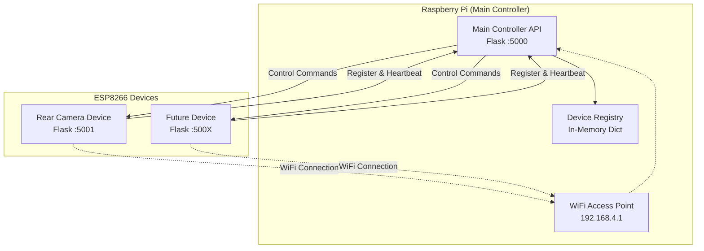

# Distributed Device Control System Architecture

## System Overview

This system consists of a Raspberry Pi main controller that hosts a WiFi access point and manages ESP8266 devices. Each device runs a specific Flask API and registers itself with the main controller.

## Architecture Diagram



## Communication Flow

### Device Registration Process

1. ESP8266 device boots and connects to Pi's WiFi access point
2. Device reads its configuration to determine device type
3. Device calls `PUT /api/v1/main-controller/device/{id}` with device info
4. Main controller validates device type restrictions
5. Main controller stores/updates device information in registry

### Heartbeat Mechanism

- Devices continuously call the PUT endpoint every 30 seconds
- Main controller updates "last_seen" timestamp
- Devices that haven't been seen for 2 minutes are marked as inactive
- Devices inactive for 5 minutes are removed from registry

### Device Control

- Main controller can send commands to devices via their specific APIs
- If a command fails, the device is marked as potentially offline
- Failed devices are removed after consecutive failures

## API Specifications

### Main Controller API (Port 5000)

#### Device Registration

```
PUT /api/v1/main-controller/device/{id}
Content-Type: application/json

{
    "device_type": "rear-camera",
    "ip_address": "192.168.4.100",
    "port": 5001
}

Response:
200 OK - Device registered successfully
409 Conflict - Device type limit exceeded
400 Bad Request - Invalid device type or data
```

### Rear Camera Controller API (Port 5001)

#### Camera Control

```
POST /api/v1/rear-camera/up
Response: 200 OK - Camera moved up

POST /api/v1/rear-camera/down
Response: 200 OK - Camera moved down
```

## Device Registry Data Structure

```python
# In-memory device registry using Python dictionaries
device_registry = {
    "rear-camera-001": {
        "device_type": "rear-camera",
        "ip_address": "192.168.4.100",
        "port": 5001,
        "last_seen": datetime.now(),
        "status": "active",
        "created_at": datetime.now()
    }
}

# Device type limits configuration
device_type_limits = {
    "rear-camera": 1  # Only one rear-camera allowed
}
```

## Device Type Configuration

Each device reads a configuration file on boot to determine its type:

### `/config/device_config.json`

```json
{
  "device_id": "rear-camera-001",
  "device_type": "rear-camera",
  "api_port": 5001,
  "main_controller_ip": "192.168.4.1",
  "main_controller_port": 5000,
  "heartbeat_interval": 30
}
```

## File Structure

```
camper-control-system/
├── main_controller/
│   ├── app.py                 # Main controller Flask app
│   ├── device_registry.py     # Device management logic
│   ├── database.py           # SQLite database operations
│   └── config.py             # Configuration settings
├── device_controllers/
│   ├── base_controller.py    # Base device controller class
│   ├── rear_camera/
│   │   ├── app.py           # Rear camera Flask app
│   │   └── camera_control.py # Camera-specific logic
│   └── future_devices/       # Extensible for new device types
├── shared/
│   ├── utils.py             # Shared utilities
│   └── constants.py         # System constants
├── config/
│   ├── device_config.json   # Device-specific configuration
│   └── main_config.json     # Main controller configuration
├── scripts/
│   ├── setup_wifi_ap.sh     # WiFi access point setup
│   ├── start_main.sh        # Start main controller
│   └── start_device.sh      # Start device controller
└── requirements.txt         # Python dependencies
```

## Security Considerations

1. **Network Isolation**: Devices operate on isolated WiFi network
2. **Device Authentication**: Device IDs must be pre-configured
3. **API Validation**: All endpoints validate input data
4. **Rate Limiting**: Prevent excessive registration attempts
5. **Logging**: Comprehensive logging for debugging and monitoring

## Deployment Process

1. **Raspberry Pi Setup**:

   - Configure WiFi access point
   - Install Python dependencies
   - Initialize in-memory device registry
   - Start main controller service

2. **ESP8266 Setup**:
   - Flash device-specific firmware
   - Configure device type in config file
   - Connect to Pi's WiFi network
   - Start device controller service

## Extensibility

The system is designed to easily add new device types:

1. Create new controller in `device_controllers/new_device/`
2. Add device type to `device_type_limits` table
3. Implement device-specific API endpoints
4. Update configuration templates

This architecture provides a scalable, maintainable foundation for the distributed device control system.
